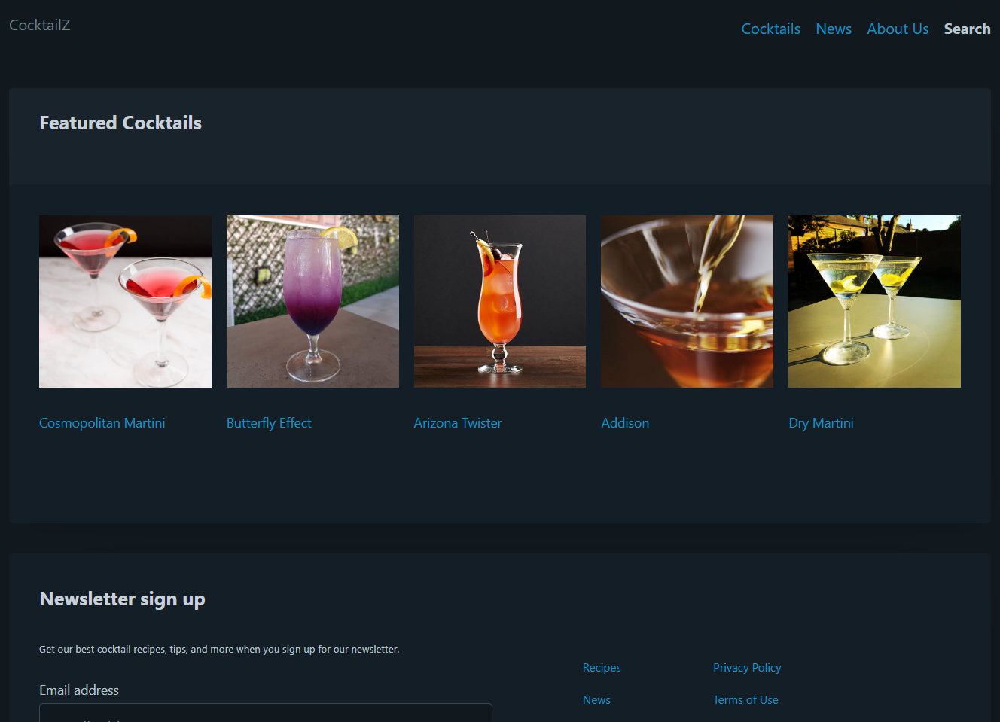
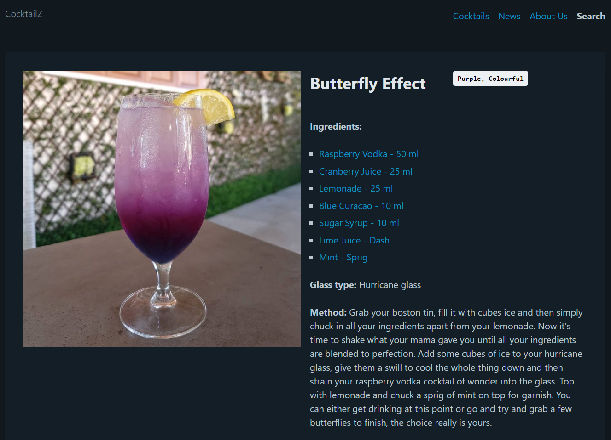
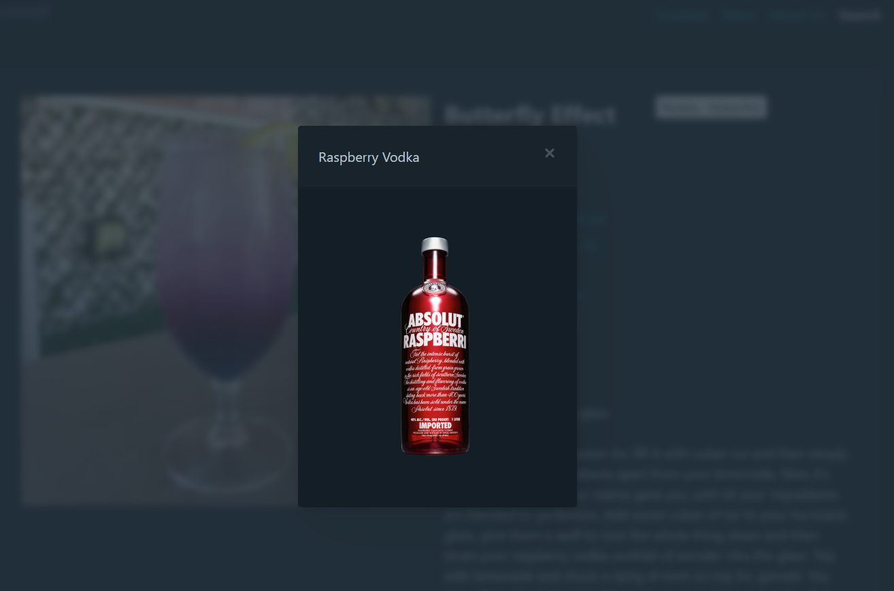

# CocktailZ

Simple website to explore various Cocktails, their ingredients and how to make them.
Written in TypeScript and ReactJS.

View live site demo: <https://melonweb.co.za/cocktailz/>

Please note that the application is still under construction and so some pages and features might not work properly.

#### Technology:

-   TypeScript
-   ReactJS
-   Axios
-   picoCSS

### Features:

-   Pull data from API (https://www.thecocktaildb.com/api.php)
-   Home page displays 5 "featured" random cocktails, with links to a further details page
-   Cocktail page displays selected cocktail title, image, ingredients and method of mixing
-   Selecting ingredient displays modal with ingredient image and description if provided

### Cocktail Details:

### Ingredient Modal:

